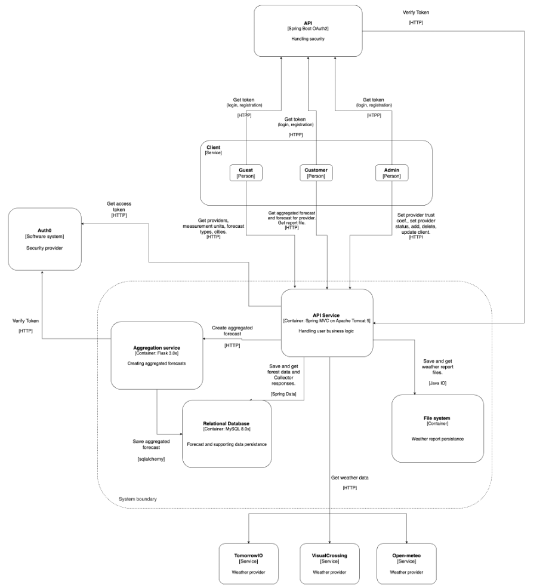

# Weather aggregator service
This repository contains a solution for a course work on the Components of software engineering course. 
It's a weather aggregator web service designed to make request to third-party APIs via HTTP and form both aggregated weather 
requests out of the data received. 


- [Visual Crossing](https://www.visualcrossing.com/weather-api) and [TomorrowIO](https://www.tomorrow.io/) were used as the provider APIs. 
- [Detailed technical requirements](https://docs.google.com/document/d/1OEQwV3Z1FlITxtBrARM2Y-MGboTBMKxp/edit?usp=sharing&ouid=101538184761084668100&rtpof=true&sd=true)
- [Full documentation](https://docs.google.com/document/d/1ifZnKSC4ZUIZkAEIYSDi0UtVEF81kMNc/edit?usp=sharing&ouid=101538184761084668100&rtpof=true&sd=true)
- [Postman requests](https://drive.google.com/file/d/1v0gy2qDVu3iPvSESCtrs-SoIMLqN1fP0/view?usp=sharing)
- [Swagger API documentation](swagger.json)

A MySQL add-on at [Clever Cloud](https://www.clever-cloud.com/) was used as the database.

OAuth2 resource server is used for securing sensitive endpoints. 


*C4 Container diagram*

### Requirements:
- Java 17 or higher
- Spring Boot (v.3.0.2)
- Maven 3.2
- Apache Tomcat 8.5

### Docker instructions
- Build the image from the Dockerfile
```
docker build -t <image name> <path to Dockerfile>
```
- Run the application from the image in the Dockerfile directory
```
docker run -p<your port>:8080 <image name>
```

